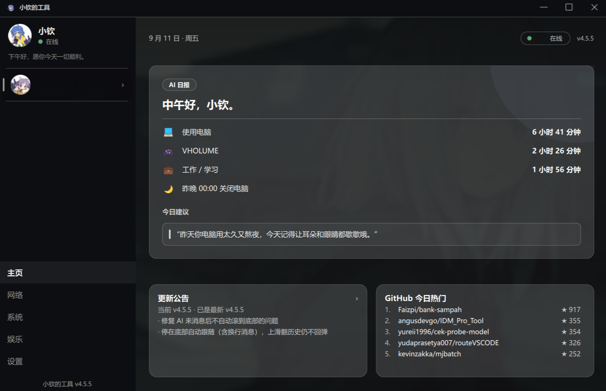

# Solace

一个 Windows 桌面小工具集，核心是一个**能长期记忆、有情绪、会主动找你聊天**的 AI 线上伙伴，另附网络、系统清理、娱乐等实用工具。

界面为 Qt Quick（QML）深色风格，支持自定义壁纸 / 玻璃外观，可通过应用内自动更新。

## 功能

- **AI 陪伴聊天**：结构化角色卡（人设 / 场景 / 示例对话 / 多条开场白），长短不一、口语化的回复；"已读"回执与在线/离线状态。
- **长期记忆**：分层记忆（用户事实 / 系统数据 / 事件 / 摘要），重要度打分与冲突消解；"未完待续"、情绪趋势、关系状态。
- **主动聊天**：基于真实桌面状态（空闲 / 心情 / 时段）与比分公式决定是否主动发起，游戏中自动保持安静。
- **主页日报**：昨天使用电脑 / 工作学习 / 关机时间 + AI 生成的今日建议；更新公告、GitHub 今日热门。
- **多联系人**：每个 AI 联系人有独立的资料、记忆目录与对话历史。
- **网络工具**：代理检测 / 启动、节点延迟、下载测速、故障自检。
- **系统工具**：清理垃圾 / 内存、大文件扫描、开机自启管理、使用报告。
- **外观**：深色 / 壁纸玻璃主题、自定义壁纸与模糊、灵动岛提示。
- **自动更新**：每小时静默检测新版本，一键下载安装。

## 截图



## 编译运行

**依赖**

- Qt 6（模块：Core, Gui, Quick, Qml, Widgets, Network, Svg, QuickControls2, Concurrent）
- CMake ≥ 3.21
- 支持 C++17 的编译器（Windows 推荐 MSYS2 / MinGW-w64）

**构建**

```bash
cmake -B build -DCMAKE_BUILD_TYPE=Release -DCMAKE_PREFIX_PATH="<你的 Qt 路径>"
cmake --build build
```

**打包（可选）**

```powershell
windeployqt --dir dist build/Solace.exe
# 使用 Inno Setup 编译 installer/setup.iss 生成安装包
```

## 使用

1. 安装后启动程序，进入 **设置 → AI 配置** 填写你自己的 API Key（DeepSeek 或任意 OpenAI 兼容接口）与模型名。
2. 在侧栏点 AI 卡片开始聊天；设置里可调整外观、壁纸、代理、隐私开关等。

> API Key 只保存在本机 `%APPDATA%\XiaoQinTools`（目录名沿用旧版以保留数据；DPAPI 加密），不会随仓库分发。

## 下载

见 [Releases](https://github.com/XiaoqinOvo-UwU/solace/releases)。请使用应用内自动更新升级，勿手动覆盖 `Program Files`。

## 许可证

本项目基于 **GNU General Public License v3.0** 发布，见 [LICENSE](LICENSE)。

```
Solace  Copyright (C) 2026  The Solace Authors
```

This program is free software: you can redistribute it and/or modify it under the terms of the GNU General Public License as published by the Free Software Foundation, either version 3 of the License, or (at your option) any later version.

This program is distributed in the hope that it will be useful, but WITHOUT ANY WARRANTY; without even the implied warranty of MERCHANTABILITY or FITNESS FOR A PARTICULAR PURPOSE. See the GNU General Public License for more details.
